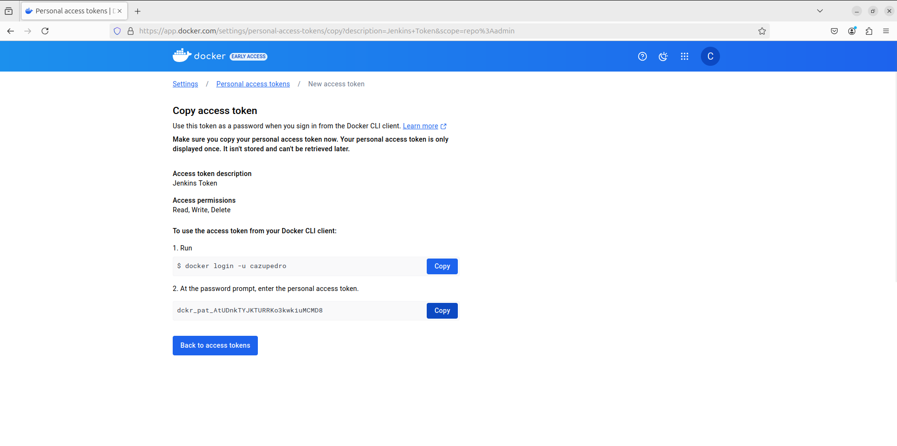
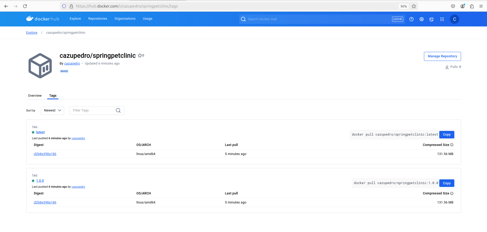

# CI-CD / JENKINS / DOCKER

Tiempo aproximado: _10 minutos_

## OBJETIVO

Configurar la interacción de _Jenkins_ y _Docker_.

### PRERREQUISITOS

Para que _Jenkins_ pueda interactuar con _Docker_ se debe agregar el usuario `jenkins` al grupo `docker`.

``` shell
sudo usermod -aG docker jenkins
```

## DESARROLLO

### DOCKERHUB

Se requiere una cuenta de usuario en:

- <https://hub.docker.com/signup>
  - Se recomienda utilizar un correo personal en la creación de la cuenta.

#### TOKEN EN DOCKERHUB

Para permitir la comunicación de _Jenkins_ a _DockerHub_ se recomienda crear un token de acceso en la siguiente dirección <https://app.docker.com/settings/personal-access-tokens/create> con los siguientes datos:

- Access Token Description: `Jenkins Token`
- Access permissions: `Read, Write, Delete`


Guarda el valor del token en un lugar seguro, ya que no existe manera de verlo nuevamente y es el que utilizaremos para el acceso desde **Jenkins**.

En este ejemplo el valor es: `dckr_pat_AtUDnk...`



Ahora, en la sección de tokens de acceso se puede apreciar el recién generado:


### JENKINS: CREDENCIALES DOCKERHUB

Como se realizarán diferentes acciones sobre el repositorio en _GitHub_ se debe crear una credencial para _Jenkins_.

Da clic en el botón `Add Credentials` en la siguiente pantalla en _Jenkins_: <http://localhost:8080/manage/credentials/store/system/domain/_/>

- Kind: `Username with password`
- Username: `cazupedro` (SU NOMBRE DE USUARIO EN DOCKERHUB)
- Treat username as secret: `Seleccionado`
- Password: `SU_TOKEN`
- ID: `dockerhubCred`
- Description: `dockerhubCred`
- Clic en el botón `Create`

")

Ahora puede verse el token recién creado.

### JENKINS: PLUGIN DOCKER

En un navegador web ingresa el enlace <http://localhost:8080/manage/pluginManager/available> para configurar el _plugin_ de _Docker_ en _Jenkins_.

En el campo de búsqueda ingrese: `Cloudbees Docker Build and Publish`


Marca la opción de `Install` y da clic en el botón `Download now and install after restart`.

Marca la opción `Restart Jenkins when installation is complete and no jobs are running` y espera hasta que se termine la instalación.

- Después de haber esperado unos 3-5 minutos y no ver cambios recarga la pantalla.

### CREACIÓN DE UN ITEM

Desde la pantalla principal (<http://localhost:8080/>):

- Haz clic en la opción: "Create a job" o en "New Item".
  - Ingresa la siguiente información:
    - Enter an item name: `job-01-docker`
    - Selecciona: `Freestyle project`
    - Clic en: `OK`

En la pantalla siguiente ingresa la siguiente información:

Sección General:

- General`
  - Description: `Publicación en DockerHub`.
  - GitHub project: `Marcado`
  - Project url: `https://github.com/fractalyst-development/CF01141024`
    - Sustituya el valor por el de su _fork_.
  
Sección de SCM:

- Source Code Management
  - Selecciona: `Git`
    - Repositories
      - Repository URL: `https://github.com/fractalyst-development/CF01141024.git`
        - Debe ser el repositorio de tu cuenta de usuario.
        - Inicialmente aparece un mensaje que indica problemas de autenticación:
          - _Failed to connect to repository …​ fatal: Authentication failed for <https://github.com/fractalyst-development/CF01141024.git/>_
    - Credentials: `githubCred`
  - Branches to build
    - Branch Specifier (blank for 'any'): `labs/devops_ci-cd`

Sección de construcción y ejecución:

_NOTA: Esta configuración es debido a la configuración del equipo asignado para el curso._

- General
  - Build steps
  - Selecciona de la lista: `Execute shell`
    - Command:
      - `docker login --username cazupedro --password dckr_pat_...`
        - Debes sustituir tu nombre de usuario en _DockerHub_ y el _token_ o contraseña

Sección de acciones post construcción:

- General
  - Build steps
  - Selecciona de la lista: `Docker Build and Publish`
    - Repository Name:
      - `cazupedro/springpetclinic`
        - Debe sustituir por su nombre de usuario.
    - Tag
      - `1.0.0`
    - Registry credentials:
      - `dockerhubCred`

Para guardar los cambios de clic en el botón `Apply` y luego en `Save`.

#### EJECUCIÓN JOB

Desde la página principal del _job_ recién creado da clic en la opción `Build now` y observa el resultado.

- NOTA: La primera ocasión que se ejecuta este _job_ puede tardar un poco.

La salida de la ejecución debe ser similar a:

``` shell
Started by user Usuario Jenkins
Running as SYSTEM
Building in workspace /var/lib/jenkins/workspace/job-01-docker
The recommended git tool is: NONE
using credential githubCred
 > git rev-parse --resolve-git-dir /var/lib/jenkins/workspace/job-01-docker/.git # timeout=10
Fetching changes from the remote Git repository
 > git config remote.origin.url https://github.com/fractalyst-development/CF01141024.git # timeout=10
Fetching upstream changes from https://github.com/fractalyst-development/CF01141024.git

...

+ docker login --username cazupedro --password dckr_pat_AtUD...
WARNING! Using --password via the CLI is insecure. Use --password-stdin.
WARNING! Your password will be stored unencrypted in /var/lib/jenkins/.docker/config.json.
Configure a credential helper to remove this warning. See
https://docs.docker.com/engine/reference/commandline/login/#credential-stores

Login Succeeded
[job-01-docker] $ docker build -t cazupedro/springpetclinic:1.0.0 --pull=true /var/lib/jenkins/workspace/job-01-docker

...

1.0.0: digest: sha256:d2b8e398a186dc9ed16666e1d43de51c4d2f819335dbdef7712e1ed6612d03f1 size: 1580
[job-01-docker] $ docker push cazupedro/springpetclinic:latest
The push refers to repository [docker.io/cazupedro/springpetclinic]
521f64b20fb5: Preparing
d36b0686846e: Preparing
...
72c290755b94: Layer already exists
144aa2325ef2: Layer already exists
521f64b20fb5: Layer already exists
2573e0d81582: Layer already exists
latest: digest: sha256:d2b8e398a186dc9ed16666e1d43de51c4d2f819335dbdef7712e1ed6612d03f1 size: 1580
Finished: SUCCESS
```

Verifique que la imagen _Docker_ se ha publicado en el repositorio local con el comando:

``` shell
docker image ls
```

Con una salida similar a:

``` shell
REPOSITORY                  TAG       IMAGE ID       CREATED         SIZE
cazupedro/springpetclinic   1.0.0     4db4d979dfbe   5 minutes ago   308MB
cazupedro/springpetclinic   latest    4db4d979dfbe   5 minutes ago   308MB
wordpress                   latest    e6e656a22e5a   13 days ago     699MB
mariadb                     latest    09f5b532c2ef   3 weeks ago     414MB
sonarqube                   latest    2433ac783140   2 months ago    1.07GB
hello-world                 latest    d2c94e258dcb   17 months ago   13.3kB
```

Verifique que la imagen _Docker_ se ha publicado en _DockerHub_ visitando: <https://hub.docker.com/r/cazupedro/springpetclinic/tags>

- Debe sustituir `cazupedro` por tu nombre de usuario.



## RESULTADO

Comente lo trabajado en esta actividad.

---

[CI-CD](05.md)
