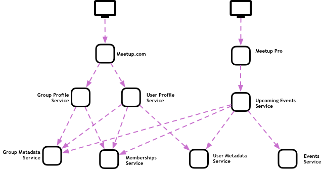
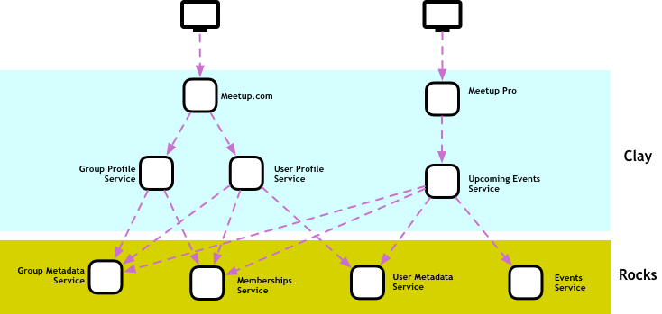
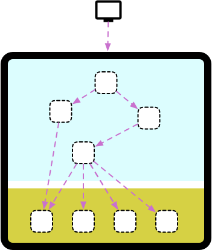
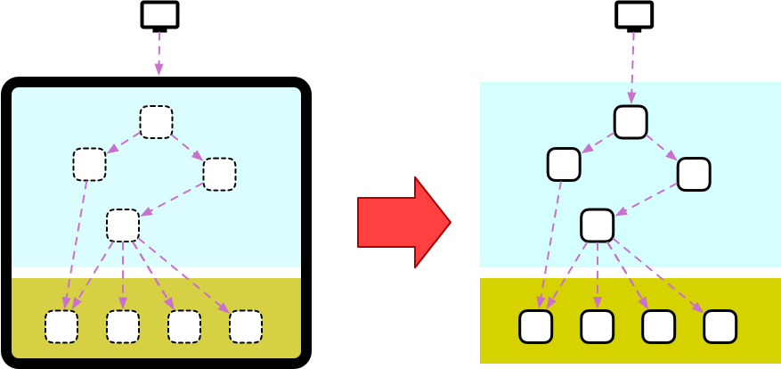

# CASO DE ESTUDIO: MEETUP.COM

Tiempo aproximado: _25 minutos_

## OBJETIVO

En esta actividad se analiza el proceso seguido por _MeetUp.com_ para migrar de una solución monolítica a un enfoque basado en microservicios.

## DESARROLLO

Lee con detenimiento el artículo [Layering Microservices](https://philcalcado.com/2018/09/24/services_layers.html).

- En caso de contar con acceso al artículo original puede utilizar este documento [PDF](mm/LayeringMicroservices.pdf) o lee la traducción proporcionada adelante.

### TRADUCCIÓN

#### LAYERING MICROSERVICES, por Phil Calçado

En Meetup, estamos atravesando el camino tan familiar de dividir un sistema monolítico en microservicios. El trabajo en esto comenzó hace unos años, y el equipo se aseguró de que la mayoría de los requisitos previos de microservicios estuvieran en su lugar antes de que tomemos más pasos. Me uní al equipo este verano para ayudar a planificar y ejecutar los cambios de arquitectura que se requieren para llevarnos al siguiente nivel.
A medida que avanzamos en este proceso, un aspecto de la arquitectura de software que es constante en nuestro día a día es el uso de capas para organizar nuestros componentes. Capas es una técnica que no se ha discutido tanto cuando se trata de microservicios. En este artículo, quiero revisar la aplicación del patrón de Capas en una arquitectura de servicios, y también discutir dos estrategias de capas y cómo han sido fundamentales para mí al migrar de arquitecturas monolíticas a microservicios.

##### Capas en arquitectura orientada a servicios

Creo que las capas son una de las herramientas más útiles en la arquitectura de software. Ayudan a los componentes del grupo y definen cómo la dependencia y las cadenas de comunicación ocurren entre ellos.

Frank Buschmann y sus colaboradores escribieron la descripción más completa de Capas en software (que yo conozco) en su trabajo Arquitectura de software orientada a patrones, volumen 1, publicado en 1996. Pero incluso antes de eso, Meilir Page-Jones había usado anteriormente el concepto para describir un tiempo de ejecución orientado a objetos, aunque usó la palabra dominios para referirse a cada capa. En particular, me gusta usar la descripción de Capas de Martin Fowler de su libro Patrones de arquitectura de aplicaciones empresariales:

> Cuando se piensa en un sistema en términos de capas, imagina los subsistemas principales en el software dispuestos en alguna forma de pastel de capas, donde cada capa descansa en una capa inferior. En este esquema, la capa superior utiliza varios servicios definidos por la capa inferior, pero la capa inferior desconoce la capa superior. Además, cada capa generalmente oculta sus capas inferiores de las capas superiores, por lo que la capa 4 utiliza los servicios de la capa 3, que utiliza los servicios de la capa 2, pero la capa 4 no tiene conocimiento de la capa 2. (No todas las arquitecturas de capas son opacas como esta, pero la mayoría son, o más bien la mayoría son opacos.) - Martin Fowler

Las capas entonces son agrupaciones de componentes apilados uno encima del otro. La palabra componente es un marcador de posición para cualquier unidad de abstracción con la que esté trabajando, por ejemplo; clases, funciones, servicios, etc.
La implementación más conocida del patrón de capa es probablemente la pila de red, incluida su implementación TCP / IP más popular. Esta elección se acredita a menudo por la flexibilidad y la consiguiente longevidad de TCP / IP, lo que hace posible extenderlos de forma imprevista cuando se diseñaron por primera vez.

Si Layering se trata de agrupar componentes y apilarlos, aún queda la pregunta de qué criterios usar cuando se agrupan componentes. De hecho, en el mismo libro citado arriba, Fowler dice:

> …la parte más difícil de una arquitectura en capas es decidir qué capas tener y cuál será la responsabilidad de cada capa. - Martin Fowler

Teniendo en cuenta nuestro enfoque en los servicios, uno podría agregar componentes en capas en función de la pila de tecnología que utilizan, su disponibilidad esperada o muchos otros criterios. Incluso dentro de una organización de ingeniería, diferentes equipos (por ejemplo, infraestructura, appsec, desarrollo de aplicaciones, administración de costos, etc.) probablemente tendrán diferentes enfoques para estos grupos, dependiendo de qué características sean más interesantes para ellos.

Por lo tanto, hay combinaciones infinitas en las que uno puede agregar servicios en capas. Es dudoso que un solo modelo de capas sea suficiente para comprender cada aspecto de su arquitectura, ya que cada uno se enfoca en un punto de vista particular.

Después de construir unas pocas arquitecturas de microservicios, he descubierto dos esquemas de capas que son invaluables para comprender y gestionar arquitecturas tan altamente distribuidas. Son tan ampliamente aplicables que me referiré a ellos como patrones de arquitectura.

##### Patrón: Modelo de capas Clay-to-Rocks

Incluso entre los servicios que tienen características similares de fiabilidad o seguridad, por ejemplo, en los servicios que implementan la lógica empresarial, encontramos que no todos son iguales en muchos otros aspectos vitales.

Consideremos un ejemplo ficticio basado en nuestro trabajo en Meetup. En nuestro sitio web Meetup.com principal de consumidores, Meetup.com, hay muchos flujos de usuarios diferentes. Centrémonos en las funciones que nuestros usuarios tocan cuando alguien está mirando un perfil. Podrían estar viendo su propio perfil de usuario o alguien que conocieron en un evento. También pueden consultar el perfil de un grupo para ver si proporcionan el tipo de experiencia que le interesa al usuario.

En una arquitectura de microservicios sofisticada, es común que cada uno de los flujos anteriores tenga sus propios microservicios centrados en el caso del usuario; a su vez, invocan microservicios de nivel inferior que tienen datos sobre grupos, usuarios, eventos, etc. Sin embargo, el sitio web del consumidor no es la única forma en que los usuarios interactúan con nosotros. Para que marcas y empresas como Google o DigitalOcean puedan organizar sus múltiples reuniones en todo el mundo, ofrecemos un producto llamado Meetup Pro. Un caso de uso común para un usuario Pro es obtener una visión general de qué eventos están programados en sus grupos. Esto también se modela como un microservicio en sí mismo, accediendo a unos pocos servicios de nivel inferior.

Siguiendo este escenario, tenemos algunos servicios que están basados en casos de uso, que ofrecen datos que se corresponden casi uno a uno con lo que el usuario ve en la pantalla, y otros que son más crudos, lo que significa que sus datos deben procesarse y filtrarse, antes de que se pueda presentar a los usuarios de manera significativa.

Cuando observamos los servicios a través de esta lente, comenzamos a ver una fuerte correlación entre la forma en que se basa un caso de un usuario o un servicio en bruto y la frecuencia con que los ingenieros los cambian a lo largo del ciclo de vida del producto. ¿Cuántas veces has visto la página de perfil de usuario en redes sociales como Facebook o Twitter para obtener un facelift desde que te uniste a estas redes? Seguramente se ven muy diferentes ahora de hace un año. Pero, si lo piensa bien, ¿con qué frecuencia los datos reales han cambiado de manera significativa, como cuando Facebook implementó su política de "nombre real" o cuando Twitter hizo "verificados" algunos perfiles?
En el desarrollo de productos, cuanto más cerca está el cliente de una pieza de software, más a menudo cambia. Los servicios en la parte superior de la pila son donde los gerentes de productos y los comercializadores desean mejorar la experiencia, donde los diseños deben actualizarse cada pocos meses y donde ocurre la mayor parte de la experimentación. Naturalmente, experimentan más abandono que otros servicios, y esto nos da la oportunidad de optimizar los componentes en esta capa para un cambio acelerado. Los componentes en la parte inferior de este diagrama, por otro lado, no cambian tan a menudo. Por supuesto, en algún momento alguien agregó un atributo a un grupo o a un usuario que no estaba allí antes, pero a menudo esto fue un gran problema, rodeado de una cuidadosa gestión de cambios y una estrategia de migración del estado anterior al nuevo. Esta dicotomía es lo suficientemente grande como para justificar su propio modelo de capas. Me gusta llamar a esto Clay-to-Rocks:

En este modelo, agrupamos los servicios según la frecuencia con la que esperamos que cambien. Clay es un apodo para el software que se espera que cambie con frecuencia, generalmente impulsado por los cambios constantes que requiere un producto de software moderno para mantenerse relevante. El software en esta capa no pretende ser frágil o poco confiable, pero las personas que lo construyen a menudo priorizarán la velocidad de iteración sobre el rendimiento o la capacidad de recuperación.

Las rocas (Rocks) son como llamamos al software subyacente que permite muchos casos de uso diferentes, el software que está tan cerca del negocio central que probablemente solo cambie si el modelo de negocio cambia. Muchos otros servicios dependen de los servicios de esta capa, lo que significa que deben construirse y mantenerse teniendo en cuenta la resistencia y el rendimiento.
Los servicios generalmente nacen como arcilla, ya que el equipo está experimentando con nuevos productos y características. Si el experimento encuentra que el producto / mercado se ajusta, generalmente se reducen a medida que más y más productos y características nuevos comienzan a desarrollarse en ellos.

##### Al migrar de monolítico a microservicios

Reconocer las diferencias entre rocas y arcilla es un rasgo común de los proyectos de migración más exitosos en los que he participado. Cuando las organizaciones llegan a un punto de su viaje en el que consideran dividir el monolito, por lo general tienen un producto central estable, pero les resulta difícil repetir rápidamente nuevas funciones o experimentos. En la mayoría de los casos, esto tiene que ver con cómo tanto la arcilla como las rocas comparten un solo sistema, el monolito.

En tal escenario, el ciclo de desarrollo ocurre a un ritmo lento porque incluso el cambio más pequeño de una característica en la capa de arcilla puede afectar inadvertidamente a una de las rocas y derribar todo. Las revisiones de código, las pruebas manuales, los despliegues lentos y muchas otras técnicas de administración de cambios deben agregarse a un proceso, lo que hace que el ciclo de retroalimentación sea más y más largo.
Es muy común que las organizaciones en esta etapa organicen sus equipos de ingeniería en torno a un gran esfuerzo para "dividir el monolito", extrayendo servicios de él. En principio, el plan parece simple:

Desafortunadamente, nunca he visto que tal esfuerzo vaya bien. Las cosas suelen ir bien siempre que tratemos con la extracción de servicios de arcilla. De hecho, la lógica en esta capa tiende a ser tan delgada y unida a la experiencia del usuario que a menudo se pueden reescribir con una buena actualización de UX.

El verdadero problema se revela cuando las personas intentan extraer las rocas. Estos no solo tienen requisitos no funcionales más estrictos, sino que también hay tantos otros subsistemas que dependen de ellos que resulta casi imposible eliminar una de estas cosas sin volver a escribir la mitad del monolito.

Un enfoque con el que he tenido más éxito, algo que han hecho los casos clásicos de Monolith-to-Microservices como Twitter o SoundCloud, es centrarse en extraer sus objetos de arcilla y no preocuparse al principio por sus rocas. Lo que debe hacer en su lugar es exponer estos objetos internamente, creando algo que a veces se llama API de puerta trasera (backdoor API).

Con un enfoque como este, uno puede extraer las rocas a lo largo del tiempo, sin dejar de iterar en su producto. Es muy común que nunca se deshaga del monolito, pero con el tiempo se vuelve cada vez menos parte de la ruta crítica, ya que el equipo extrae objetos o la empresa necesita cambiar, y el nuevo dominio se implementa como microservicios desde el principio.

##### Patrón: Modelo de capas de borde interno y externo

Una perspectiva importante al visualizar arquitecturas de aplicaciones distribuidas es poder colocar servicios según el lugar donde viven en la red.
La mayoría de las arquitecturas tendrán una variación del modelo a continuación:

Donde el usuario que interactúa con una aplicación a través de algo como una página web, una aplicación móvil o API generará tráfico entrante a sus servicios. Independientemente de cuántos servicios necesite para cumplir con la tarea en cuestión; la solicitud del usuario por lo general llega a un solo servicio. Este servicio a menudo se denomina puerta de enlace API y es responsable de averiguar a cuál de sus muchos microservicios llamar en respuesta a esta solicitud específica.

Algo que podría no estar claro en el diagrama anterior es que la puerta de enlace de el API a menudo delegará algunas de sus propias responsabilidades a otros componentes. A menos que desee construir un API monolítica, las preocupaciones como la autenticación de usuarios, la geolocalización, la limitación de velocidad y las pruebas A / B deben ser servicios separados.

Estos servicios auxiliares son diferentes de sus microservicios típicos en muchas formas interesantes. No solo no implementan la lógica de la aplicación, directamente relacionada con su negocio principal, sino que a menudo tienen requisitos más estrictos relacionados con la disponibilidad y la escalabilidad. Otro rasgo que comparten estos componentes es que tratan con datos provenientes del mundo exterior y necesitan desinfectarlos antes de enviarlos al servicio interno. Esto significa que tienen que aplicar una buena cantidad de programación defensiva.

Debido a que estos servicios se encuentran bajo requisitos un tanto estrictos, realizar cambios en ellos tiende a requerir un proceso más cuidadoso; por ejemplo, es posible que desee ejecutar pruebas de rendimiento antes de implementar modificaciones en estos sistemas de ruta crítica o una auditoría de seguridad antes de realizar cambios en la lógica de autenticación. Probablemente necesitará un enfoque más sofisticado para implementar cambios en esta capa, tal vez con implementaciones en verde / azul, ya que cualquier tiempo de inactividad aquí hará que todo su producto esté fuera de línea. Todo esto hace que el ciclo de desarrollo de componentes en este nivel sea más lento que otros servicios, ya que existe un mayor riesgo de incidentes de gran alcance.

Aunque la sobrecarga es justificable para estos componentes especiales, definitivamente no queremos un ritmo tan lento para nuestros microservicios regulares. Una forma de ayudar a una organización a entender qué componentes tienen los requisitos más estrictos en comparación con cuáles son sus piezas habituales que se mueven rápidamente mediante la aplicación de un esquema de capas que me gusta llamar Edge-Internal-External:

En este modelo, modelamos explícitamente los servicios descritos anteriormente como lo que llamo la capa Edge. Son el punto de entrada que recibe solicitudes de los usuarios y hace todo lo necesario para traducirlas en solicitudes dentro de su arquitectura de forma segura.

Entonces tenemos servicios en la capa interna. Esos serán la gran mayoría de sus microservicios, y pueden hacer muchas más suposiciones sobre sus clientes y entornos, incluido el hecho de que esas solicitudes han sido saneadas, tienen metadatos para el rastreo distribuido, etc.

También hay servicios en la capa externa. Estos son servicios con los que nuestros sistemas hablan, pero no los desarrollamos o implementamos de una manera que podamos controlar, por lo general, servicios de terceros.

La capa de borde (edge) en sí puede implementarse de muchas maneras diferentes. Varios proveedores ofrecen opciones todo en uno que permiten a las personas subcontratar por completo, productos como API Gateways o Service Meshes. Las organizaciones que trabajan a una escala más alta o con requisitos más complejos pueden querer construir y poseer al menos partes de su arquitectura Edge. Esto es especialmente cierto si no están contentos con la naturaleza monolítica de los productos disponibles en el mercado y desean aplicar una arquitectura de microservicios a esta capa.

Dado el enfoque en la disponibilidad y el rendimiento de los componentes en esta capa, es común que el equipo que la posee no sea un equipo de Ingeniería de Producto, sino que se encuentre dentro de la plataforma o la infraestructura.

##### Al migrar de monolítico a microservicios (2)

De manera similar al modelo de capas Clay-to-Rocks, los criterios utilizados por el modelo Edge-Internal-External tienen cierta correlación con los componentes de agrupación por lo difíciles que son cambiarlos. Es decir, la capa Edge a menudo requiere una gestión de cambios más estricta, similar a las rocas en el otro modelo. Sin embargo, estos modelos no son los mismos y existen diferencias sutiles pero fundamentales entre ellos.

Una forma en que pueden surgir tales diferencias es al migrar de arquitecturas monolíticas a microservicios. El modelo Clay-To-Rocks sugiere que dejes tus rocas dentro del monolito todo el tiempo que tengas que hacerlo. Sin embargo, en un esquema de capas Edge-Internal-External, tenemos a Edge como un punto de alto apalancamiento, lo que significa que un pequeño esfuerzo aplicado aquí puede causar una mejora masiva en todos los sistemas.

Un enfoque muy popular cuando se usa el Edge para alejar a una organización de los sistemas monolíticos es mediante el uso del Patrón de estrangulador (Strangler), primero catalogado por Martin Fowler y descrito más detalladamente en un artículo (y diagrama) de Paul Hammant:

La idea básica detrás de un estrangulador es que coloque una pieza de middleware entre el usuario y el sistema heredado. Al principio, el middleware redireccionará todas las solicitudes que reciba al sistema heredado y devolverá sus respuestas al usuario. Luego puede escribir de manera incremental reemplazos para los subsistemas del legado y desplegarlos en producción. El middleware es lo suficientemente inteligente como para redirigir el tráfico destinado a ese subsistema a la nueva implementación (a menudo inspeccionando la URL solicitada) mientras se redirige el resto del tráfico al sistema heredado. Eventualmente, se escriben más y más subsistemas, y las nuevas versiones reemplazan toda la aplicación heredada.

En nuestro modelo Edge-Internal-External, la capa Edge ofrece un lugar intuitivo para este punto de estrangulamiento. Un enfoque generalizado para la migración de microservicios es comenzar por eliminar esta capa del monolito. En esta etapa, no solo puede extraer lentamente la lógica del monolito en sus propios microservicios sin cambiar ninguna de las aplicaciones de su cliente.

Otra ventaja de esta estrategia es que también puede asegurarse de que las nuevas características ya estén implementadas como microservicios y que aún tengan acceso a características vitales como la autenticación y el almacenamiento en caché. En mi experiencia, el mayor desafío en un gran esfuerzo de refactorización, como la adopción de microservicios, es asegurarse de que mientras un equipo extrae la lógica del monolito, no existan otros equipos que lo agreguen. Este patrón le ofrece una manera de limpiar sus sistemas antiguos sin impedir que las personas trabajen en nuevas funciones.

##### La complejidad de gestionar la complejidad

Gran parte de la arquitectura de software se trata de mantener la complejidad bajo control. Las capas pueden ser una excelente manera de contener la entropía en tu sistema, pero a veces sucede que los equipos se enamoran del patrón y comienzan a exagerar. Cuando use Capas, le recomiendo que primero comience aplicando algunos modelos simples como los anteriores. Cualquier modelo con más de tres o cuatro capas me huele mal, ¿tal vez está intentando agrupar dos modelos de capas diferentes?

Otro aspecto del uso de un patrón arquitectónico es asegurarse de que todos los ingenieros comprendan el por qué y cómo hacerlo. No importa cuántos diagramas sofisticados haya enterrado en alguna página de Confluencia si su equipo no aprecia sus capas, lo ignorarán por completo o pasarán mucho tiempo debatiendo si un servicio determinado debería estar en la capa X o Y. Al igual que cualquier otra herramienta en la arquitectura empresarial, las capas solo son útiles cuando son simples y ampliamente entendidas.

##### Agradecimientos

Etel Sverdlov, Vitor Pellegrino, José Muanis, Thompson Marzagão, Brian Gruber, Danilo Sato, y Douglas Campos.

## RESULTADO

Realice una breve presentación (3-5 minutos) de los aspectos que considera más relevantes del articulo previamente analizado.

## REFERENCIAS

- [Layering Microservices](http://philcalcado.com/2018/09/24/services_layers.html)

---

[DISEÑO DE MICROSERVICIOS](../../M03.md)
