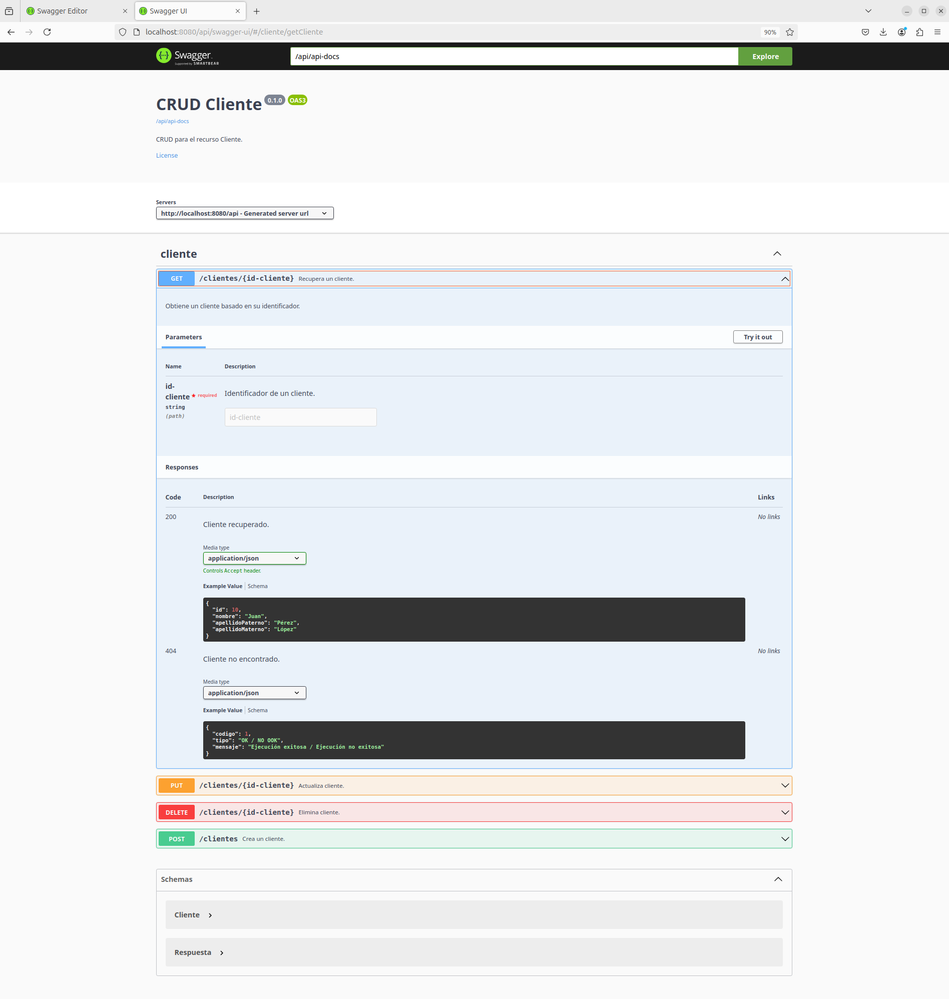

# API FIRST

Tiempo aproximado: _20 minutos_

## OBJETIVO

Aplicar el enfoque API First.

## PRERREQUISITOS

### REPOSITORIO

Esta actividad requiere que el repositorio de trabajo este en:

- Rama: `labs/microservices-design`
  - Se recomienda siempre trabajar sobre una rama _feature_.
    - Por ejemplo: `git checkout -b labs/microservices-design_cazucito`
- Carpeta: `/home/usuario/Desktop/CF01141024/apis`

## DESARROLLO

Para esta actividad se recomienda la utilización del Editor Web de Swagger:

- <https://editor.swagger.io/>

_De tener experiencia en algún otro estándar o herramienta puede ser utilizada._

### FLUJO GENERAL

El flujo general de esta tarea es:

1. Analizar el contrato de _Swagger Petstore - OpenAPI 3.0_.
2. Modificarlo para un catálogo de clientes.
   1. Solo las operaciones básicas CRUD sobre la entidad _Cliente_
3. Creación del código de servidor.
   1. Puedes utilizar la tecnología de tu preferencia.
4. Iniciar el código de servidor.
5. Probar la funcionalidad.
   1. Utilice algún cliente REST como Postman, Insomnia, Thunder Client, etcetera.

### SPRING

#### CÓDIGO YAML

``` yaml
openapi: 3.0.3
info:
  title: CRUD Cliente
  description: |-
    CRUD para el recurso Cliente.
  version: 0.1.0

servers:
  - url: https://localhost:8080/api
tags:
  - name: cliente
    description: CRUD del recurso Cliente
paths:
  /clientes:
    post:
      tags:
        - cliente
      summary: Crea un cliente.
      description: Crea un cliente.
      operationId: createCliente
      requestBody:
        description: Crea un cliente.
        content:
          application/json:
            schema:
              $ref: '#/components/schemas/Cliente'
      responses:
        '201':
          description: Cliente creado.
  /clientes/{id-cliente}:
    get:
      tags:
        - cliente
      summary: Recupera un cliente.
      description: Obtiene un cliente basado en su identificador.
      operationId: getCliente
      parameters:
        - name: id-cliente
          in: path
          description: 'Identificador de un cliente.'
          required: true
          schema:
            type: string
      responses:
        '200':
          description: Cliente recuperado.
          content:
            application/json:
              schema:
                $ref: '#/components/schemas/Cliente'          
        '404':
          description: Cliente no encontrado.
          content:
            application/json:
              schema:
                $ref: '#/components/schemas/Respuesta'
    put:
      tags:
        - cliente
      summary: Actualiza cliente.
      description: El usuario sólo puede actualizar sus datos.
      operationId: updateCliente
      parameters:
        - name: id-cliente
          in: path
          description: 'Identificador de un cliente.'
          required: true
          schema:
            type: string
      requestBody:
        description: Datos para actualizar el estado de un cliente
        content:
          application/json:
            schema:
              $ref: '#/components/schemas/Cliente'
      responses:
        '200':
          description: successful operation
          content:
            application/json:
              schema:
                $ref: '#/components/schemas/Cliente'
        '400':
          description: Datos incorrectos.
          content:
            application/json:
              schema:
                $ref: '#/components/schemas/Respuesta'
        '404':
          description: Cliente no encontrado.
          content:
            application/json:
              schema:
                $ref: '#/components/schemas/Respuesta'
    delete:
      tags:
        - cliente
      summary: Elimina cliente.
      description: El usuario sólo puede eliminar sus datos.
      operationId: deleteCliente
      parameters:
        - name: id-cliente
          in: path
          description: 'Identificador de un Respuesta.'
          required: true
          schema:
            type: string
      responses:
        default:
          description: Eliminación exitosa.
          content:
            application/json:
              schema:
                $ref: '#/components/schemas/Respuesta'
        '400':
          description: Datos incorrectos.
          content:
            application/json:
              schema:
                $ref: '#/components/schemas/Respuesta'
        '404':
          description: Cliente no encontrado.   
          content:
            application/json:
              schema:
                $ref: '#/components/schemas/Respuesta'
components:
  schemas:
    Cliente:
      type: object
      properties:
        id:
          type: integer
          format: int64
          example: 10
        nombre:
          type: string
          example: Juan
        apellidoPaterno:
          type: string
          example: Pérez
        apellidoMaterno:
          type: string
          example: López
    Respuesta:
      type: object
      properties:
        codigo:
          type: integer
          format: int32
          example: 1
        tipo:
          type: string
          example: OK / NO OOK
        mensaje:
          type: string
          example: Ejecución exitosa / Ejecución no exitosa
```

#### GENERACIÓN Y DESCARGA

Selecciona la opción de descarga: `Generate Server / spring`.

Descomprima y analice el contenido del proyecto generado.

#### CONSTRUCCIÓN

En un terminal en el contexto raíz del proyecto:

``` shell
mvn clean install
```

Sí al ejecutar el comando de construcción se encuentra una salida semejante a:

``` shell
[INFO] -------------------------------------------------------------
[ERROR] COMPILATION ERROR : 
[INFO] -------------------------------------------------------------
[ERROR] .../SwaggerPetStore-OpenAPI/src/gen/java/io/swagger/api/ApiResponseMessage.java:[3,35] package jakarta.xml.bind.annotation does not exist
[ERROR] ...SwaggerPetStore-OpenAPI/src/gen/java/io/swagger/api/ApiResponseMessage.java:[5,30] package jjakarta.xml.bind.annotation does not exist
[ERROR] .../SwaggerPetStore-OpenAPI/src/gen/java/io/swagger/api/ApiResponseMessage.java:[6,21] package jjakarta.annotation does not exist
[ERROR] .../SwaggerPetStore-OpenAPI/src/gen/java/io/swagger/api/ApiResponseMessage.java:[45,6] cannot find symbol
  symbol:   class XmlTransient
  location: class io.swagger.api.ApiResponseMessage
[INFO] 4 errors 
[INFO] -------------------------------------------------------------
[INFO] ------------------------------------------------------------------------
[INFO] BUILD FAILURE
[INFO] ------------------------------------------------------------------------
[INFO] Total time:  3.001 s
[INFO] Finished at: 2024-10-19T16:44:57-06:00
[INFO] ------------------------------------------------------------------------
```

Adicione las siguientes dependencias al _pom.xml_:

``` xml
        <dependency>
           <groupId>javax.xml.bind</groupId>
           <artifactId>jaxb-api</artifactId>
           <version>2.3.0</version>
         </dependency>
         <dependency>
           <groupId>com.sun.xml.bind</groupId>
           <artifactId>jaxb-core</artifactId>
           <version>2.3.0</version>
         </dependency>
         <dependency>
           <groupId>com.sun.xml.bind</groupId>
           <artifactId>jaxb-impl</artifactId>
           <version>2.3.0</version>
         </dependency>
```

Repita la construcción.

#### EJECUCIÓN

En una terminal en el contexto raíz del proyecto ejecute el comando:

``` shell
java -jar target/swagger-spring-1.0.0.jar
```

#### VISUALIZACIÓN

En un navegador visite: <http://localhost:8080/api/swagger-ui/#/clientes-api-controller>

Analice la página que muestra los endpoints definidos.



De conocer la plataforma tecnológica, escriba la implementación de las funcionalidades.

## REFERENCIAS

- [SWagger Editor](https://editor.swagger.io/)
- [Swagger Editor Next](https://editor-next.swagger.io/)

---

[DISEÑO DE MICROSERVICIOS](../../M03.md)
